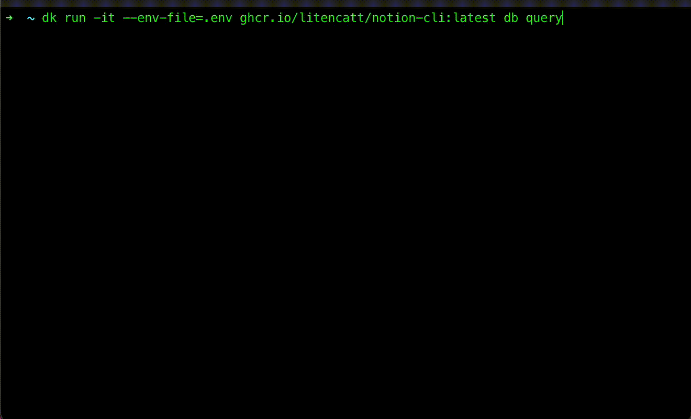

# notion-cli

This is a Notion CLI tool written by TypeScript. And some commands can be executed in interactive mode.

## Features

* Support for multiple output formats including csv and JSON
* Support interactive mode for CRUD operation.


## Quick Start

Retrieves a page object using the ID specified.<br>

```sh
$ export NOTION_TOKEN=secret_xxx...
$ notion-cli page retrieve <PAGE_ID>
```

* How to create a `NOTION_TOKEN`: https://developers.notion.com/docs/create-a-notion-integration
* `PAGE_ID` is included in the page URL: `https://www.notion.so/Page-title-<PAGE_ID>`


Using docker image:

```sh
$ docker run -e NOTION_TOKEN=secret_xxx... ghcr.io/litencatt/notion-cli page retrieve <PAGE_ID>

# -it flag is required to run interactive mode using docker
$ docker run -it -e NOTION_TOKEN=secret_xxx... ghcr.io/litencatt/notion-cli db retrieve
```

### Multiple output formats

oclif [ux.table](https://oclif.io/docs/table) supported output formats are `table`, `csv`, `json`, `yaml`. And notion-cli supports output raw json response with `--raw`.

#### default: table

Output columns are only `title`, `object`, `id`, `url` now.
```sh
$ notion-cli page retireve c77dbaf240174ea1ac1e93a87269f3ea
 Title      Object Id                                   Url
 ────────── ────── ──────────────────────────────────── ─────────────────────────────────────────────────────────────────
 Page title page   c77dbaf2-4017-4ea1-ac1e-93a87269f3ea https://www.notion.so/Page-title-c77dbaf240174ea1ac1e93a87269f3ea
```

#### csv

```sh
$ notion-cli page retrieve c77dbaf240174ea1ac1e93a87269f3ea --output csv
Title,Object,Id,Url
Page title,page,c77dbaf2-4017-4ea1-ac1e-93a87269f3ea,https://www.notion.so/Page-title-c77dbaf240174ea1ac1e93a87269f3ea
```

#### json

```sh
$ notion-cli page retrieve c77dbaf240174ea1ac1e93a87269f3ea --output json
[
  {
    "title": "Page title",
    "object": "page",
    "id": "c77dbaf2-4017-4ea1-ac1e-93a87269f3ea",
    "url": "https://www.notion.so/Page-title-c77dbaf240174ea1ac1e93a87269f3ea"
  }
]
```

### yaml

```sh
$ notion-cli page retrieve c77dbaf240174ea1ac1e93a87269f3ea --output yaml
- title: Page title
  object: page
  id: c77dbaf2-4017-4ea1-ac1e-93a87269f3ea
  url: 'https://www.notion.so/Page-title-c77dbaf240174ea1ac1e93a87269f3ea'
```

### Raw json

This flag returns the raw json response from the Notion API, so you can get all the data for a given resource. You can also process the response using [`jq`](https://jqlang.github.io/jq/) or other tools.

```sh
$ notion-cli page retrieve c77dbaf240174ea1ac1e93a87269f3ea --raw | head
{
  "object": "page",
  "id": "c77dbaf2-4017-4ea1-ac1e-93a87269f3ea",
  "created_time": "2023-05-07T09:08:00.000Z",
  "last_edited_time": "2023-08-15T01:08:00.000Z",
  "created_by": {
    "object": "user",
    "id": "3555ae80-4588-4514-bb6b-2ece534157de"
  },
  "last_edited_by": {
...
```

### Interactive mode in db command

1. Start interactive mode execute db command without args
1. Select a database from list
1. Build filter conditions
    * And then you can choose whether to save the conditions to a json file or not.
1. Query to db with the filter conditions
1. Saved json files can be reused by passing them as flags at the next execution.



## Install

npm:

```sh
$ npm install -g @litencatt/notion-cli
```

docker:

```sh
$ docker pull ghcr.io/litencatt/notion-cli
```

## Commands

* [`notion-cli block`](docs/block.md)
* [`notion-cli page`](docs/page.md)
* [`notion-cli db`](docs/db.md)
* [`notion-cli user`](docs/user.md)
* [`notion-cli search`](docs/search.md)
* [`notion-cli help`](docs/help.md)

## Supported API and functions

Endpoint | API | Support | multi-format | interactive mode
-- | -- | -- | -- | --
Authentication | Create a token |   |   |  
Blocks | Append  a block children |  |   |  
Blocks | Retrieve  a block | o |   |  
Blocks | Retrieve a block children | o |   |  
Blocks | Update a block |   |   |  
Blocks | Delete a block | o |   |  
Pages | Create a page | o | o |  
Pages | Retrieve a page | o | o |  
Pages | Update a page |  |  |  
Database | Create a database | o | o | o
Database | Retrieve a database | o | o | o
Database | Update a database | o | o | o
Database | Query a database | o | o | o
Users | List all users | o | o |  
Users | Retrieve a user | o | o |  
Users | Retrieve your token's bot user | o | o |  
Comments | Create a comment |   |   |  
Comments | Retrieve a comment |   |   |  
Search | Search by title | o | o |

\* multi-format not supported commands output only raw json response
